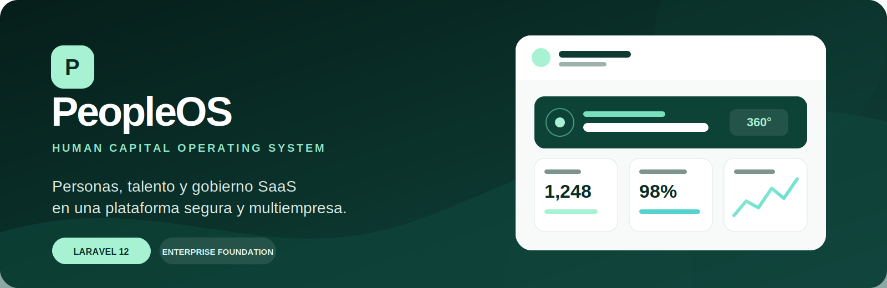
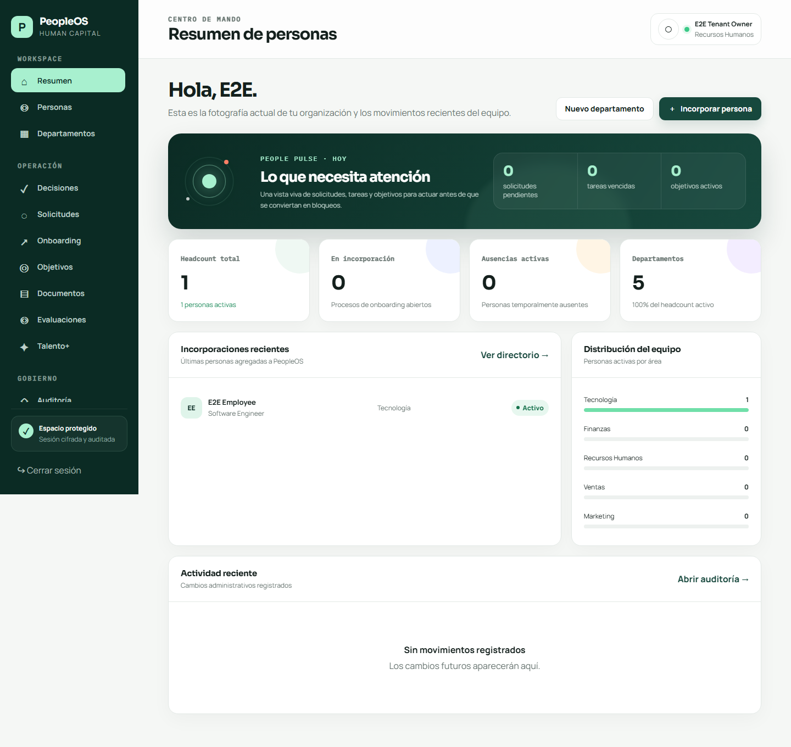
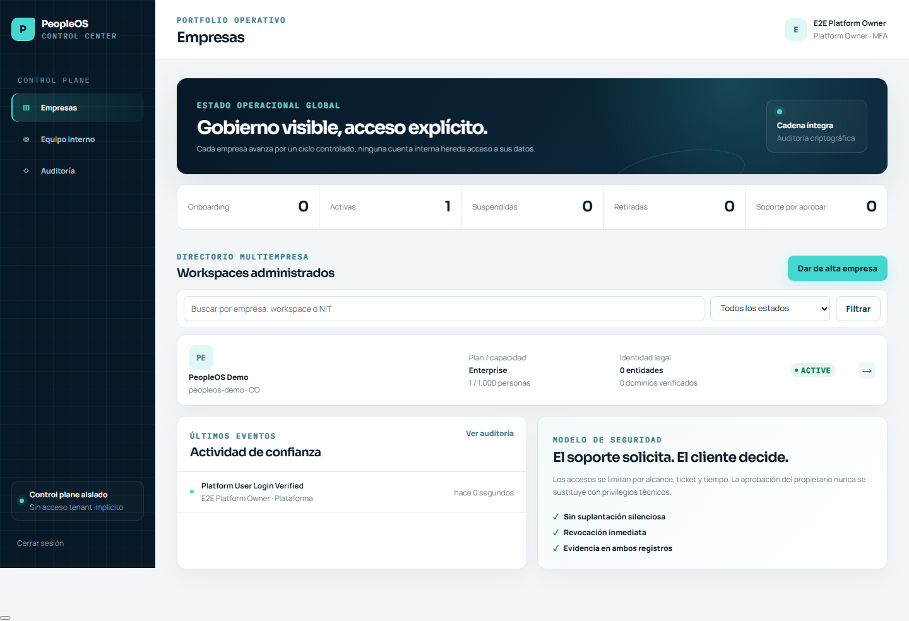
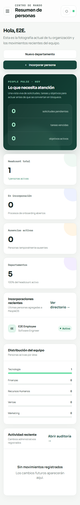
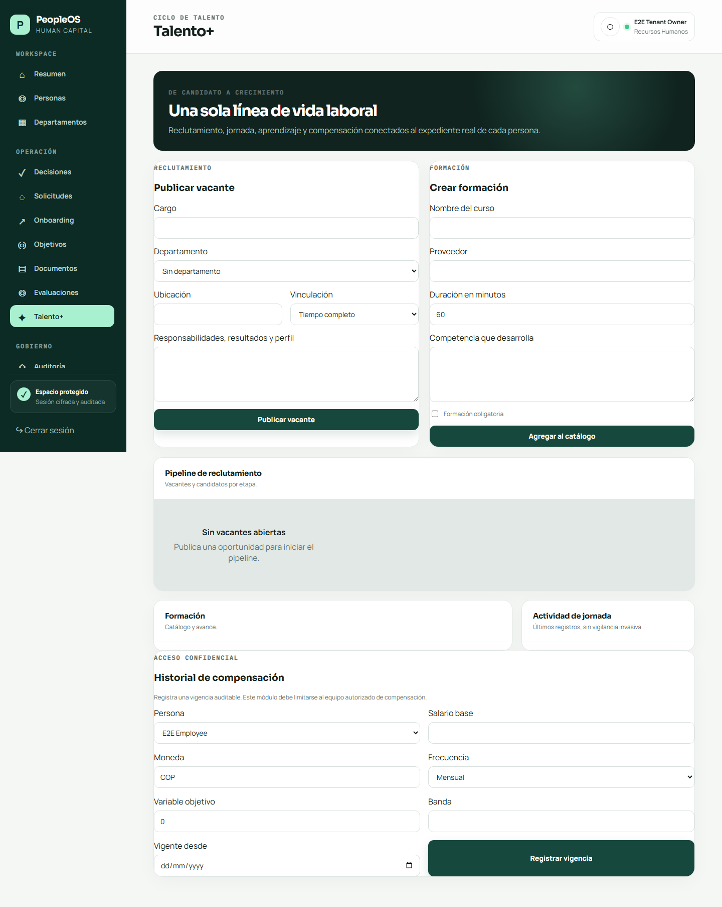
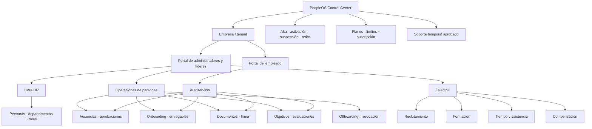
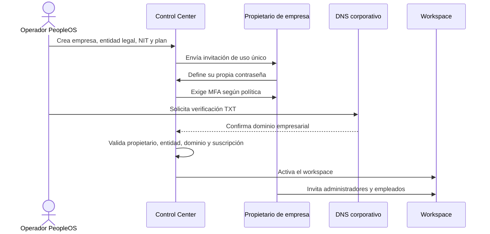
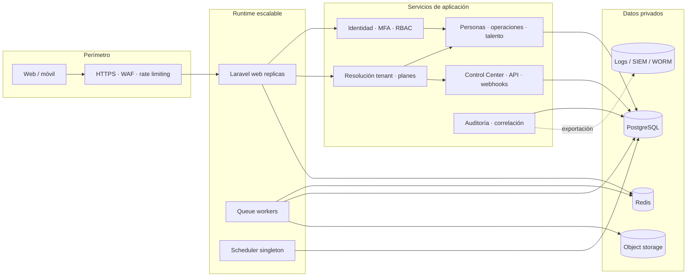

<p align="center">
  
</p>

<p align="center">
  <a href="https://github.com/DanielCamiloAmaya/gestion-empleados/actions/workflows/quality.yml"></a>
  
  
  
  
  
</p>

<p align="center">
  <strong>El sistema operativo de capital humano para administrar personas, talento y gobierno SaaS desde una sola plataforma.</strong>
</p>

PeopleOS transforma el proyecto original de gestión de empleados en una plataforma multiempresa con tres fronteras de identidad independientes: empleados, administradores corporativos y operadores internos de la plataforma. Integra el ciclo laboral, las decisiones de RR. HH., los entregables, el talento, la seguridad y la operación comercial del SaaS.

> **Estado verificable:** la aplicación está lista para demostraciones y pilotos controlados. La suite local aprobó 65 pruebas PHP con 288 aserciones y 22 flujos E2E headless. La certificación, el pentest independiente y un SLA productivo requieren evidencia de la infraestructura definitiva; PeopleOS no los presenta como completados antes de tiempo.

## Experiencia de producto

<p align="center">
  
</p>

<table>
  <tr>
    <td width="62%">
      
      <p align="center"><strong>Control Center</strong><br>Gobierno independiente del portafolio multiempresa.</p>
    </td>
    <td width="38%">
      
      <p align="center"><strong>Responsive real</strong><br>Operación consistente en escritorio y móvil.</p>
    </td>
  </tr>
</table>

<details>
  <summary><strong>Ver Talento+</strong></summary>
  <br>
  
</details>

## Qué hace diferente a PeopleOS

La propuesta no depende de sumar pantallas aisladas. El producto conecta gobierno, operación de personas y evidencia auditable bajo una misma arquitectura.

| Decisión de producto | Enfoque PeopleOS | Valor empresarial |
|---|---|---|
| Gobierno SaaS | Control Center separado de los portales de cada cliente | El personal de plataforma no hereda acceso implícito a datos tenant |
| Multiempresa | Contexto organizacional, restricciones por tenant y pruebas de acceso cruzado | Reduce el riesgo de fuga entre compañías |
| Soporte | Acceso temporal solicitado, aprobado por el cliente, acotado y revocable | El cliente conserva el control y ambas partes obtienen evidencia |
| Ciclo de vida | Alta, cambios, ausencias, desempeño, documentos y salida conectados | Menos silos y mejor trazabilidad de cada persona |
| Entregables | Versionado, archivos privados, revisión y rechazo motivado | Convierte las tareas en flujos empresariales verificables |
| Planes | Capacidades y límites aplicados en backend | Evita que el catálogo comercial sea solamente decorativo |
| Aseguramiento | Gates que distinguen código, operación y validación independiente | Impide presentar certificaciones o SLA sin evidencia |
| Extensibilidad | API con scopes, webhooks firmados y catálogo de integraciones | Base preparada para conectar el ecosistema del cliente |

## Mapa del producto



## Capacidades

| Dominio | Funcionalidad implementada |
|---|---|
| Core HR | Directorio, ficha laboral, jerarquía, departamentos, centros de costo, estados, búsqueda, filtros, soft delete e importación/exportación CSV |
| Identidad y acceso | Tres guards, roles y permisos granulares, MFA TOTP, recovery codes, recuperación de contraseña, invitaciones de un solo uso y ciclo de vida de administradores |
| Ausencias | Políticas, saldos, festivos, detección de cruces, solicitudes, bandeja unificada, aprobación/rechazo motivado y calendario |
| Onboarding | Tareas, responsables, prioridad, fechas, estado y entregables profesionales versionados |
| Entregables | PDF, Office, OpenDocument, CSV/JSON/XML, ZIP e imágenes; descarga autorizada, revisión, aprobación o rechazo |
| Documentos | Expediente privado, checksum SHA-256, firma electrónica con evidencia y escaneo antivirus opcional con ClamAV |
| Desempeño | Objetivos, progreso, ciclos de evaluación, envío, reconocimiento y estados vacíos seguros |
| Offboarding | Checklist, separación controlada e invalidación de sesiones, tokens y accesos pendientes |
| Talento+ | Vacantes, candidatos y pipeline; catálogo y asignación de formación; asistencia; historial de compensación restringido |
| Comunicación | Notificaciones persistentes y bandeja de decisiones para RR. HH. y líderes |
| Plataforma | API tokens con scopes y vigencia, revocación, webhooks HMAC con reintentos, OIDC con PKCE y SCIM 2.0 |
| Gobierno | Auditoría tenant, auditoría de plataforma encadenada, correlación de solicitudes y controles de cumplimiento con evidencia |
| Operación SaaS | Empresas, entidades legales y NIT, dominios DNS, planes, capacidad, suscripciones, suspensión/reactivación y soporte JIT |
| Reporting | Panel ejecutivo, People Pulse, reportes operativos y exportaciones autorizadas |

### Alcance honesto de las integraciones

- **SSO y SCIM:** la base de protocolo, configuración y autorización está implementada; cada proveedor real debe validarse con su metadata, claims y política de aprovisionamiento.
- **Marketplace:** es un catálogo de capacidades. Una ficha no significa que el conector esté instalado ni certificado.
- **Cumplimiento:** registra controles, responsables y evidencia. No sustituye una auditoría ni acredita por sí mismo SOC 2, ISO 27001 u otra certificación.
- **Alta disponibilidad:** existen Dockerfile, probes y manifiestos Kubernetes de referencia. La disponibilidad solo puede demostrarse desplegando, observando y probando la infraestructura final.

## Flujo profesional de alta de una empresa



El desarrollador o el equipo de PeopleOS crea la organización y envía la invitación; nunca debe conocer la contraseña definitiva del cliente. Después, el propietario empresarial gobierna sus administradores y empleados dentro de su propio tenant.

## Arquitectura



### Stack

- PHP 8.2+ y Laravel 12
- Blade, CSS moderno, JavaScript progresivo y Vite 8
- PostgreSQL recomendado en producción; SQLite aislado para desarrollo y E2E
- Redis para cache, sesiones y colas distribuidas
- Object storage privado compatible con S3
- PHPUnit 11 y Playwright
- Contenedor OCI y referencia de despliegue Kubernetes

## Modelo de seguridad

- Sesiones cifradas, cookies `HttpOnly`/`SameSite`, cierre de navegador y páginas autenticadas con `no-store`.
- Expiración por inactividad y absoluta: administradores 15 minutos/8 horas; empleados 30 minutos/12 horas.
- Estado laboral y versión de credencial comprobados en cada solicitud; una cuenta inactiva pierde una sesión ya abierta.
- MFA TOTP compatible con Microsoft Authenticator, Google Authenticator, 1Password y aplicaciones equivalentes.
- Login con rate limit, regeneración de sesión y logout únicamente por `POST`.
- Contraseñas robustas, recuperación anti-enumeración y tokens hash de 30 minutos/uso único.
- Autorización por permiso, organización, relación laboral, alcance del token y feature del plan.
- Archivos fuera del directorio público, nombre interno aleatorio, allowlist, límite de 25 MB, hash y antivirus fail-closed opcional.
- CSP, HSTS bajo HTTPS, anti-framing, `nosniff`, Referrer Policy y Permissions Policy.
- Auditoría append-only de plataforma con HMAC-SHA256 y enlace al evento anterior.
- SAST OWASP, SBOM CycloneDX, dependency review, auditorías de dependencias y DAST ZAP en CI.

Consulta [SECURITY.md](SECURITY.md) para el reporte responsable y [los gates de aseguramiento](docs/ENTERPRISE_ASSURANCE_GATES.md) antes de hacer afirmaciones de cumplimiento.

## Planes y enforcement

El catálogo inicial permite demostrar capacidad comercial sin confundirla con facturación definitiva.

| Plan | Personas | Entidades legales | Dominios | Capacidades incluidas |
|---|---:|---:|---:|---|
| Growth | 100 | 1 | 2 | Core HR, ausencias, onboarding y documentos |
| Business | 500 | 5 | 10 | Growth + evaluaciones, offboarding y API |
| Enterprise | 10.000 | 100 | 250 | Todas las capacidades, SSO, SCIM, auditoría avanzada y SLA configurable |

Los límites de personas, entidades, dominios y módulos se validan en el backend. Precios, impuestos, moneda, descuentos y condiciones del SLA deben definirse en el acuerdo comercial real.

## Instalación local

### Requisitos

- PHP 8.2 o superior y Composer 2
- Node.js 22 recomendado y npm
- Extensiones PHP requeridas por Laravel
- SQLite para la demo local

### Puesta en marcha

```powershell
git clone https://github.com/DanielCamiloAmaya/gestion-empleados.git
cd gestion-empleados
composer install
npm ci
Copy-Item .env.example .env
php artisan key:generate
New-Item -ItemType File database/database.sqlite -Force
php artisan migrate
php artisan db:seed --class=LocalDemoSeeder
npm run build
php artisan serve
```

Abre `http://127.0.0.1:8000`.

### Credenciales exclusivas de la demo local

| Perfil | URL | Usuario | Contraseña |
|---|---|---|---|
| Plataforma | `/control-center/login` | `control@peopleos.local` | `Control-PeopleOS-2026!` |
| Propietario de empresa | `/admin/login` | `admin@peopleos.local` | `PeopleOS-Demo-2026!` |
| Líder empleado | `/login` | `lider.demo` | `Employee-Demo-2026!` |
| Empleado | `/login` | `empleado.demo` | `Employee-Demo-2026!` |

`LocalDemoSeeder` se bloquea fuera del entorno `local`. Nunca uses estas credenciales ni este seeder en producción.

### Primer acceso con MFA

1. Instala una aplicación TOTP, por ejemplo Microsoft Authenticator, Google Authenticator o 1Password.
2. Inicia sesión en Control Center.
3. Escanea el código QR o introduce manualmente la clave mostrada.
4. Escribe el código de seis dígitos que genera la aplicación.
5. Conserva los códigos de recuperación en un gestor seguro.

El MFA del personal de plataforma es obligatorio y no puede omitirse.

## Verificación

```powershell
php artisan test
vendor/bin/pint --test
composer audit --locked
npm audit
npm run build
php artisan peopleos:readiness --profile=application --json
npm run test:e2e
```

La suite Playwright se ejecuta en Chromium headless, usa una base SQLite aislada, datos deterministas y el puerto `8001`; no modifica la base local de desarrollo.

### Evidencia de la versión

| Control | Resultado local |
|---|---:|
| PHPUnit | 65 pruebas · 288 aserciones |
| Playwright E2E | 22/22 flujos |
| Accesibilidad medida | 0 controles anónimos · 0 textos menores de 12 px |
| Calidad visual | 0 overflow en superficies auditadas |
| Consola y red | 0 errores de página · 0 respuestas 5xx · 0 requests fallidos |
| Supply chain | 0 avisos conocidos en `composer audit` y `npm audit` |
| Build y estilo | Vite y Pint aprobados |

El detalle está en el [reporte de remediación y aseguramiento](docs/REPORTE_REMEDIACION_2026-07-18.md).

## Producción

La topología productiva requiere, como mínimo:

- PostgreSQL administrado con TLS y restauraciones verificadas;
- Redis distribuido para cache, sesiones y colas;
- object storage privado, cifrado y con política de retención;
- HTTPS, cookies `Secure`, secret manager y rotación;
- réplicas web, workers, scheduler, probes, PDB y autoscaling;
- logs centralizados, métricas, trazas, alertas y evidencia de SLO;
- ClamAV activo con `DELIVERABLES_ANTIVIRUS_ENABLED=true`;
- pruebas de carga, restauración, conmutación, pentest independiente y revisión de privacidad.

Ejecuta el gate en staging equivalente a producción:

```bash
php artisan peopleos:readiness --profile=production --json
```

La liberación se bloquea si el entorno no acredita configuración productiva, sesiones durables, Redis, cola asíncrona, object storage y cookies seguras.

## Documentación

- [Control Center y ciclo SaaS](docs/CONTROL_CENTER.md)
- [Operación empresarial](docs/ENTERPRISE_OPERATIONS.md)
- [Gates de aseguramiento](docs/ENTERPRISE_ASSURANCE_GATES.md)
- [Privacidad y cumplimiento](docs/PRIVACY_COMPLIANCE.md)
- [Plantilla de SLA](docs/SLA.md)
- [Reporte final de remediación](docs/REPORTE_REMEDIACION_2026-07-18.md)
- [Roadmap](ROADMAP.md)
- [Política de seguridad](SECURITY.md)

## Licencia y uso comercial

El proyecto conserva la licencia MIT de su base original. La licencia permite uso comercial, modificación y distribución, pero no concede exclusividad. Antes de vender una edición enterprise, define con asesoría legal la propiedad intelectual, las marcas, el contrato SaaS, el DPA, los términos de soporte y el modelo de licenciamiento.
