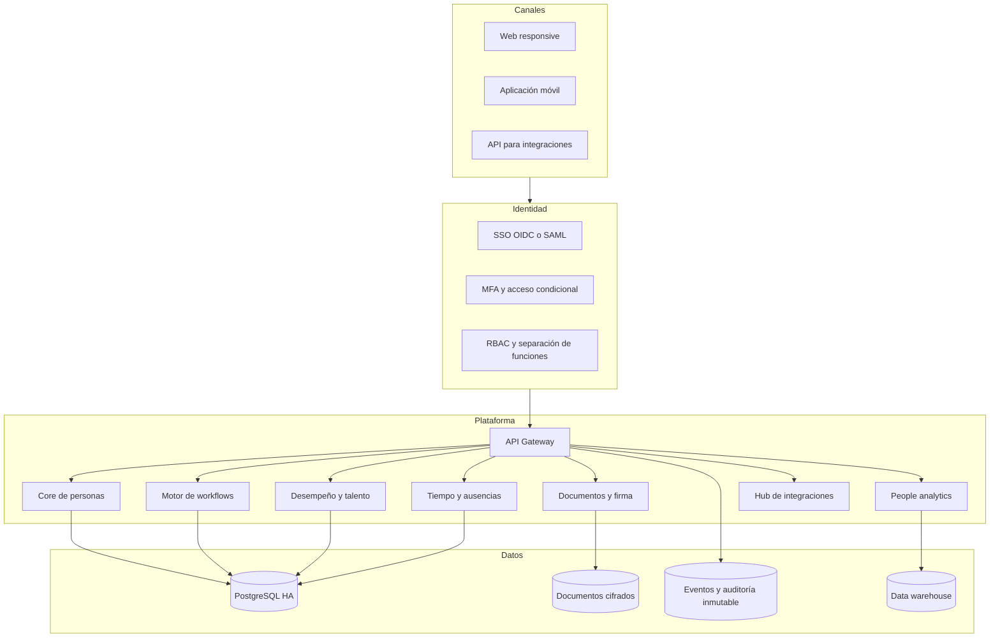

# Roadmap empresarial de PeopleOS

## Objetivo

Convertir la fundación actual en una plataforma global de gestión de capital humano segura, configurable, integrable y auditable. Este roadmap distingue lo ya implementado de lo que aún debe construirse; evita confundir una interfaz pulida con preparación empresarial real.

## Estado de la fundación

Entregado en la fase actual:

- acceso separado para empleados y RR. HH.;
- autorización de lectura y escritura;
- directorio, ficha laboral, estructura y centros de costo;
- estados laborales y borrado lógico;
- auditoría administrativa;
- dashboard operativo;
- solicitudes de ausencia con aprobación básica;
- onboarding con tareas, entregables privados versionados y revisión por jefe o RR. HH.;
- objetivos de desempeño y progreso;
- People Pulse para prioridades operativas;
- diseño responsive;
- cabeceras y sesiones seguras;
- dependencias actualizadas y CI de calidad.

## Arquitectura objetivo

## P0 — condición para producción empresarial

1. **Tenancy y aislamiento**: organizaciones, scopes obligatorios, claves únicas por tenant y pruebas de fuga cruzada.
2. **Identidad empresarial**: SSO OIDC/SAML, MFA, recuperación segura, políticas de sesión y SCIM.
3. **Autorización granular**: roles configurables, permisos por campo, separación de funciones y aprobaciones.
4. **Plataforma de datos**: PostgreSQL HA, cifrado administrado, backups, PITR y simulacros de restauración.
5. **Privacidad**: clasificación de datos, minimización, retención, exportación, eliminación legal y consentimiento.
6. **Operación**: logs centralizados, métricas, trazas, alertas, SLO, runbooks y respuesta a incidentes.
7. **Supply chain**: SBOM, dependencias automáticas, análisis SAST/DAST, secretos y artefactos firmados.
8. **Aseguramiento**: threat model, OWASP ASVS, pentest externo, revisión de accesibilidad WCAG 2.2 AA.
9. **Entrega**: entornos aislados, migraciones reversibles, despliegue progresivo y rollback probado.
10. **Gobierno**: dueños de controles, SLA de vulnerabilidades, evidencias y preparación SOC 2 / ISO 27001.

## P1 — producto HRIS competitivo

- organigrama interactivo e historial de posiciones;
- ampliar onboarding ya funcional con offboarding, plantillas, responsables múltiples, firma y SLA;
- ampliar ausencias ya funcionales con calendarios, saldos y aprobaciones multinivel;
- documentos, plantillas, firma electrónica y expedientes;
- ampliar objetivos ya funcionales con evaluaciones, feedback 360 y calibración;
- compensación, bandas salariales, revisiones y equidad;
- reclutamiento y conversión candidato-empleado;
- formación, habilidades, certificaciones y planes de carrera;
- encuestas de pulso, eNPS y planes de acción;
- portal de managers y bandeja unificada de aprobaciones;
- conectores con nómina, control horario, ERP y colaboración.

## P2 — escala global y diferenciación

- multiidioma, monedas, zonas horarias y calendarios locales;
- reglas configurables por país y entidad legal;
- marketplace de integraciones y webhooks versionados;
- workforce planning, escenarios y presupuesto de plantilla;
- people analytics con métricas gobernadas y linaje;
- automatización asistida por IA con revisión humana, explicabilidad, evaluaciones y controles de sesgo;
- residencia regional de datos y recuperación multi-región.

## Gate de salida empresarial

Una versión se considera candidata empresarial solo si, además de las pruebas funcionales:

- no tiene vulnerabilidades conocidas críticas o altas sin mitigación;
- demuestra aislamiento entre organizaciones;
- restaura un backup dentro del RTO/RPO comprometido;
- soporta carga representativa con SLO medidos;
- supera pentest externo y revisión de privacidad;
- dispone de monitoreo, guardias, runbooks y rollback;
- ofrece accesibilidad WCAG 2.2 AA en flujos críticos;
- mantiene evidencia de auditoría y cadena de suministro.
