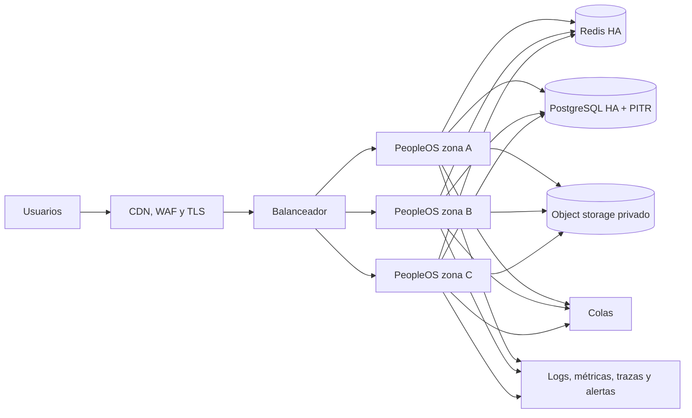

# Operación empresarial de PeopleOS

Este documento define el diseño de producción y los controles mínimos para operar PeopleOS. Los objetivos de disponibilidad solo se consideran comprometidos cuando la infraestructura, las alertas y una prueba de recuperación han sido validadas en el entorno del cliente.

## Arquitectura de referencia

- Tres réplicas web sin estado, distribuidas entre zonas.
- Sesiones, caché y colas en Redis administrado con cifrado y autenticación.
- PostgreSQL administrado multi-zona, TLS obligatorio, backups continuos y recuperación a un punto en el tiempo.
- Archivos en object storage privado, versionado, cifrado KMS y política de retención.
- Despliegues rolling con `readinessProbe`, presupuesto de disrupción y rollback inmutable.
- Secretos desde el secret manager del proveedor; nunca en imágenes, manifiestos o repositorio.

El manifiesto de referencia está en `infra/kubernetes/peopleos.yaml`. Requiere una imagen ya construida y servicios administrados externos; deliberadamente no instala una base de datos de una sola réplica dentro del clúster.

## SLO y alertas

| Indicador | Objetivo inicial | Alerta rápida | Alerta sostenida |
|---|---:|---:|---:|
| Disponibilidad mensual | 99,9 % | error budget 5 % en 1 h | error budget 10 % en 6 h |
| Latencia p95 web | < 750 ms | > 1 s durante 10 min | > 750 ms durante 30 min |
| Error HTTP 5xx | < 0,5 % | > 2 % durante 5 min | > 0,5 % durante 30 min |
| Cola más antigua | < 120 s | > 300 s | > 120 s durante 20 min |
| Recuperación de backup | 100 % semanal | cualquier fallo | — |

`/health/ready` valida base de datos y almacenamiento local. El balanceador debe retirar una réplica cuando responda `503`. Los logs incluyen `X-Request-ID` y deben centralizarse fuera del contenedor.

## Recuperación ante desastres

- Objetivo RPO inicial: 15 minutos.
- Objetivo RTO inicial: 2 horas.
- Backup de PostgreSQL: continuo/PITR y snapshot diario con retención de 35 días.
- Object storage: versionado y replicación regional según clasificación de datos.
- Secretos y configuración: respaldo cifrado desde el secret manager.
- Ensayo: restauración aislada semanal automatizada y ejercicio integral trimestral.

### Procedimiento de recuperación

1. Declarar incidente, asignar comandante y congelar despliegues.
2. Identificar el punto de restauración anterior al evento.
3. Restaurar PostgreSQL en una instancia aislada y ejecutar comprobaciones de integridad.
4. Restaurar o reconectar object storage versionado.
5. Desplegar la misma imagen inmutable y ejecutar migraciones con `--force` solo después de validar compatibilidad.
6. Probar login, aislamiento por organización, lectura de documentos, aprobaciones, API y auditoría.
7. Cambiar tráfico, observar métricas y comunicar recuperación.
8. Conservar evidencia y completar postmortem sin culpables en cinco días hábiles.

Una copia existente no cuenta como backup verificado hasta que su restauración haya pasado estas comprobaciones.

## Despliegue y rollback

1. CI ejecuta estilo, pruebas, auditorías, build, E2E, SAST/DAST y genera SBOM.
2. La imagen se identifica por digest, no por `latest`.
3. Se ejecuta backup previo a cambios destructivos.
4. Las migraciones deben ser compatibles hacia atrás: expandir, desplegar y luego contraer.
5. El rollout se detiene ante errores de readiness o degradación del SLO.
6. El rollback usa el digest anterior; las migraciones irreversibles requieren un plan de recuperación de datos aprobado.

## Gestión de incidentes

Severidades: SEV-1 indisponibilidad o exposición confirmada; SEV-2 degradación crítica; SEV-3 impacto limitado; SEV-4 solicitud operativa. Todo SEV-1 activa contención, preservación de evidencia, rotación de credenciales afectadas y evaluación legal de notificación.
